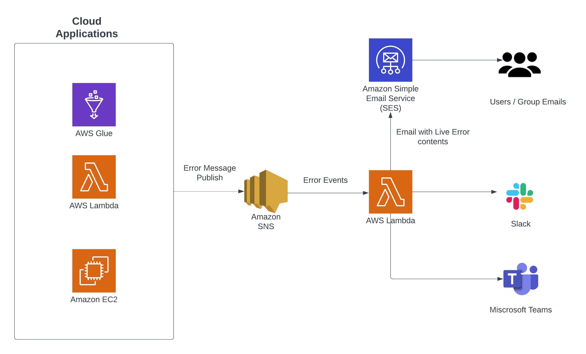
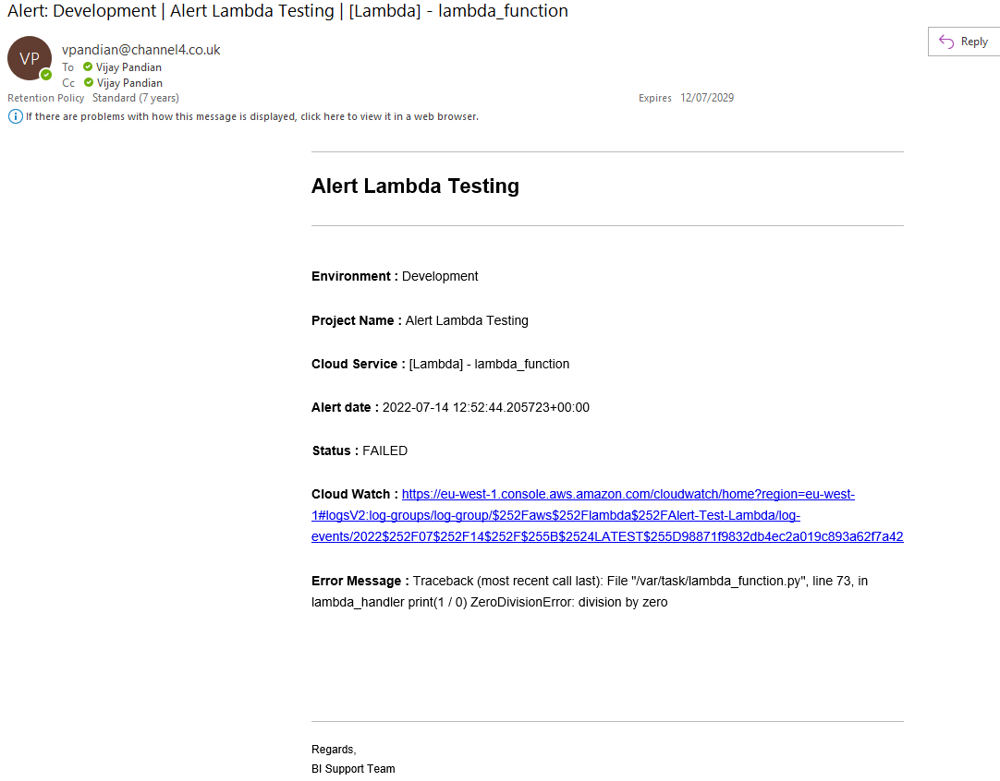

# PROBLEM
As a data engineer, many times we need to monitor the daily load jobs running in lambda, glue or airflow. It's always
challenging to monitor the status and capture the errors instantly. I always thought about having a simple solution that 
can be used for multiple projects. This thought made me think and develop this solution. I am assuming this would help you 
in your project. 

# DESIGN GOALS
* lightweight design
* one point configuration
* template based model
* easy to manage, scale, maintain from Application End

# ARCHITECTURE

# SOLUTION - STEPS
1. Create an **AWS SNS** - Topic Example - `alert_notifications_sns`
2. Create an **AWS Lambda** - Function Example - `alert_notifications_Lambda`
3. Create a Subscription in **AWS SNS** - Topic `alert_notifications_sns` (created using step 1)
4. We use **AWS Lambda** - Function to manage and maintain Email templates in **AWS Simple Email Service (SES)**
5. Based on `events` from `SNS` topic, **AWS Lambda** reads the configuration and sends alerts to various channels like
   Email, Slack or Teams.

**NOTE: Both USER and GROUP email addresses should be verified in AWS Simple Email Service (SES).**
You can check this at AWS Simple Email Service (SES) -> Verified Identities 

# Repository 
This repo contains the python code that should be used in `alert_notifications_Lambda`

## Examples -  How to use this alert module?
1. Lambda
2. Glue 

